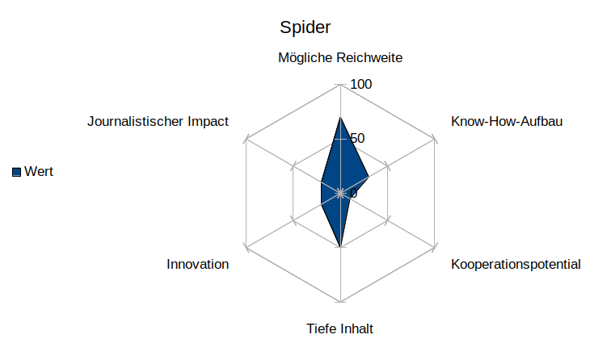

# cas-ddj-abschlussarbeit

* **Idee**

  Spannende Website **ortsnamen.ch**. Mit den Daten könnte man ein Thema entwickeln, das von allgemeinem Interesse sein kann. Ich möchte Häufigkeiten und Verteilungen ansehen. 

  
  
* **Ausgangsthese**
  
  Nach Beratung mit Thomas Widmer (Schweizer Familie): Namen von Heiligen in Orts-, Flur-, Gebäudenamen usw. finden und auf Häufigkeit/Seltenheit, Männer/Frauen etc. untersuchen. Eventuell auf den deutschsprachigen Bereich beschränkt, damit wir . Eine Art Ranking erstellen, in Grafiken oder auf Karte grafisch darstellen.
  
* **Einschätzung von Aufwand/Ertrag vor Beginn des Projektes**
  
  Für mich ist der Aufwand in jeden Fall gross, weil ich am Anfang mit Daten stehe und Erfahrungen sammle. Keine realen Bedingungen.
  
* **Bezeichnung des Knackpunkts des Projektes**
  
  Technische Herausforderungen. 
  
* **Kurze Zusammenfassung des Gesprächs mit einer Briefing Person**
  
  _Thomas Widmer, Schweizer Familie_
  
  Kleine unterhaltsame Geschichte zum Thema "Beliebteste Heiligennamen" in der Kategorie "Unnützes Wissen". Eventuell mit Grafiken, Karten ergänzt.
  
* **Datensatz** 
    _Bitte herunterladen. Der Datensatz ist zu gross, um ihn im Repository zu speichern._
    
  * https://drive.google.com/open?id=1kCYv7qOFqk_hldi7rKaBkZovVTyndVfP oder
    
  * https://shop.swisstopo.admin.ch/de/products/landscape/names3D
  
  * Entpacken
  
  * swissNAMES3D_LV95
  
  * shp_LV95_LN02
  
      Benötigte Dateien:
  
      swissNAMES3D_PKT.dbf
  
      swissNAMES3D_PKT.prj
  
      swissNAMES3D_PKT.shp
  
      swissNAMES3D_PKT.shx
  
  
* **Programmiercodes** 

  01_ortsnamen_exploring_data.ipynb, 02_ortsnamen_plotting.ipynb, 03_ortsnamen_queries.ipynb, 04_ortsnamen_heiligennamen.ipynb

* **Arbeitsprotokoll (Nicht fulltime)**
  
  * Woche 01/20: Daten ansehen / Themen überlegen.
  
  * Woche 02/20: Letzter Kurstag. Repo für Abschluss ertstellt. Daten ansehen / Themen überlegen.
  
  * Woche 03/20: **ortsnamen.ch**: Verschiedene Versuche, die Daten zu scrapen. Funktioniert nicht. Neuer Versuch mit Daten von **Swisstopo**, weil ortsnamen.ch darauf basiert.
  
  * Woche 04/20: Besprechung mit Barnaby wegen grosser Datenmenge und Zusammenarbeit mit Journalisten. Exploring, plotting.
  
  * Woche 05/20: Besprechung Thomas Widmer, Festlegung Thema "Heligennamen". Exploring, plotting.
  
  * Woche 06/20: Besprechung Thomas Widmer, Daten nicht ausreichend, nicht aussagekräftig. Dokumentation des Projekts.
  
  * Woche 07/20: Dokumentation des Projekts. Abgabe.

  
* **Protokoll des Scheiterns**

  Zeitaufwand war gross. Ich wusste, dass ich viel Zeit benötige. Für mich war der Lernprozess wichtig, um technisches Verständnis für weitere Projekte zu sammeln. xxxx meinen Beruf und xxxx
  
  Verschiedene Versuche, die Daten zu scrapen sind gescheitert. Für meinem Wissensstand ist es zu kompliziert, wenn es überhaupt möglich ist. [[Seit meinen ersten Versuchen im Januar wurde die Website verändert, sodass ich die Wege kaum noch nachvollziehen kann.]] Versuche siehe Odner "versuch_scraping_ortsnamen.ch".
   
   Neuer Versuch mit Daten von **Swisstopo** "swissNAMES3D", weil ortsnamen.ch darauf basiert. Datensatz heruntergeladen. Beim Untersuchen der Daten musste ich festestellen, dass sie überraschend unvollständig sind und somit nicht aussagekräftig. Das hätte ich bei der Quelle und Datenmenge nicht vermutet.
  
 
  Neuer Datensatz, exploring
  **Fazit: Dieser Datensatz von Swisstopo ist überrschaschend unvollständig und damit nicht aussagekräftig.**
  
  
  
  
## jjhjjkgjkjj

hhh jhhjj ljbj hhj khbjk jhhjk g kj jkjjkgkjgk jgkjgkjgkj gkjhgkjhg kjhhh jhhjj ljbj hhj khbjk jhhjk g kj jkjjkgkjgk jgkjgkjgkj gkjhgkjhg kjhhh jhhjj ljbj hhj khbjk jhhjk g kj jkjjkgkjgk jgkjgkjgkj gkjhgkjhg kjhhh jhhjj ljbj hhj khbjk jhhjk g 

jkjjkgkjgk jgkjgkjgkj gkjhgkjhg kjhhh jhhjj ljbj hhj khbjk jhhjk g kj jkjjkgkjgk jgkjgkjgkj gkjhgkjhg kjhhh jhhjj ljbj hhj khbjk jhhjk g kj jkjjkgkjgk jgkjgkjgkj gkjhgkjhg kjhhh jhhjj ljbj hhj khbjk jhhjk g kj jkjjkgkjgk jgkjgkjgkj gkjhgkjhg kjhhh jhhjj ljbj hhj khbjk jhhjk g kj jkjjkgkjgk jgkjgkjgkj gkjhgkjhg kjhhh jhhjj ljbj hhj khbjk jhhjk g kj jkjjkgkjgk jgkjgkjgkj gkjhgkjhg kjhhh jhhjj ljbj hhj khbjk jhhjk g kj jkjjkgkjgk jgkjgkjgkj gkjhgkjhg kj

