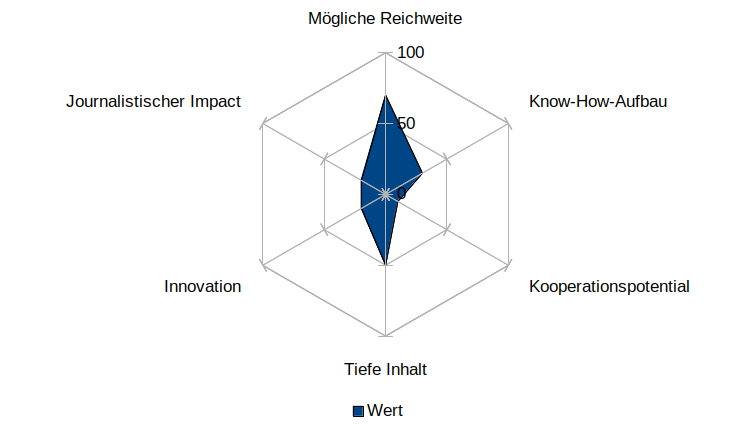

# cas-ddj-abschlussarbeit

* **Idee**

  Spannende Website **ortsnamen.ch**. Mit den Daten könnte man ein Thema entwickeln, das von allgemeinem Interesse sein kann. Ich möchte Häufigkeiten und Verteilungen ansehen. 

  
  
* **Ausgangsthese**
  
  Nach Beratung mit Thomas Widmer, Schweizer Familie: Namen von Heiligen in Orts-, Flur-, Gebäudenamen usw. finden und auf Häufigkeit/Seltenheit, Männer/Frauen etc. untersuchen. Eventuell auf den deutschsprachigen Bereich beschränken. Eine Art Ranking erstellen, in Grafiken oder auf Karte grafisch darstellen.
  
* **Einschätzung von Aufwand/Ertrag vor Beginn des Projektes**
  
  Für mich ist der Aufwand in jeden Fall gross, weil ich am Anfang mit der Datenarbeit stehe und Erfahrungen sammle. Keine realen Bedingungen.
  
* **Bezeichnung des Knackpunkts des Projektes**
  
  Technische Herausforderungen. 
  
* **Kurze Zusammenfassung des Gesprächs mit einer Briefing Person**
  
  _Thomas Widmer, Schweizer Familie_
  
  Kleine unterhaltsame Geschichte zum Thema "Beliebteste Heilige" in der Kategorie "Unnützes Wissen". Eventuell mit Grafiken, Karten ergänzt.
  
* **Datensatz** 
    _Bitte herunterladen. Der Datensatz ist zu gross, um ihn im Repository zu speichern._
    
  * https://drive.google.com/open?id=1kCYv7qOFqk_hldi7rKaBkZovVTyndVfP oder
    
  * https://shop.swisstopo.admin.ch/de/products/landscape/names3D
  
  * Entpacken
  
  * swissNAMES3D_LV95
  
  * shp_LV95_LN02
  
      Benötigte Dateien:
  
      swissNAMES3D_PKT.dbf
  
      swissNAMES3D_PKT.prj
  
      swissNAMES3D_PKT.shp
  
      swissNAMES3D_PKT.shx
  
  
* **Programmiercodes** 

  01_swisstopo_exploring_data.ipynb
  
  02_swisstopo_plotting.ipynb
  
  03_swisstopo_queries.ipynb
  
  04_swisstopo_heiligennamen.ipynb

* **Arbeitsprotokoll (Nicht fulltime)**
  
  * Woche 01/20: Daten ansehen / Themen überlegen.
  
  * Woche 02/20: Letzter Kurstag. Repo für Abschluss ertstellt. Daten ansehen / Themen überlegen.
  
  * Woche 03/20: Verschiedene Versuche, die Daten von "ortsnamen.ch" zu scrapen. Funktioniert nicht. Neuer Versuch mit Daten von Swisstopo-Daten, weil ortsnamen.ch darauf basiert.
  
  * Woche 04/20: Besprechung mit Barnaby wegen grosser Datenmenge und Zusammenarbeit mit einem Journalisten. Exploring, plotting.
  
  * Woche 05/20: Besprechung Thomas Widmer, Festlegung Thema "Heligennamen". Exploring, plotting.
  
  * Woche 06/20: Besprechung Thomas Widmer, Daten nicht ausreichend, nicht aussagekräftig. Bereinigen und Beschreiben der Codes, Dokumentation des Projekts.
  
  * Woche 07/20: Dokumentation des Projekts. Abgabe.

  
* **Protokoll des Projekts**

  * Ich wusste, dass ich mehr Zeit benötigen würde, als unter realistischen Bedingungen möglich wären. Für mich war der Lernprozess wichtig, um technisches Verständnis für weitere Projekte und Anwendungsmöglichkeiten in meinen Beruf zu sammeln.
  
  Verschiedene Versuche mit Requests und Selenium, die Daten von "ortsnamen.ch" zu scrapen, sind gescheitert. Für meinem Wissensstand ist es zu kompliziert, wenn es überhaupt möglich ist. [[Seit meinen Versuchen im Januar wurde die Website verändert, sodass ich die Wege kaum noch nachvollziehen kann.]] Die Versuche liegen im Ordner "versuch_scraping_ortsnamen.ch".
   
   "ortsnamen.ch" basiert auf Daten von Swisstopo, darum habe ich den Datensatz "swissNAMES3D" heruntergeladen. Beim Untersuchen der Daten musste ich feststellen, dass sie überraschend unvollständig sind, darum lohnte es sich nicht, tiefer in die Suche einzusteigen. 
   
   Ein Beispiel: Im Kanton ZH werden nur drei Namen angezeigt, die mit "St. " beginnen, obwohl es allein in der Stadt Zürich diverse Kirchen mit diesem Namensanfang gibt. Siehe Programmiercode 04. 
   
   Dass die Daten nicht ausreichend sein würden, hätte ich bei der Quelle und der Menge nicht vermutet. Swisstopo schreibt: "SwissNAMES3D ist mit rund 400 000 georeferenzierten Einträgen die umfangreichste Sammlung von geografischen Namen der Schweiz. Dieser kostenlose Namendatensatz basiert auf einem einfachen Datenmodell und liefert für viele Anwendungen die ideale Datengrundlage."
   
  **Fazit: Dieser Datensatz von Swisstopo ist überrschaschend unvollständig und damit nicht aussagekräftig für das Thema.**
  
  
 
